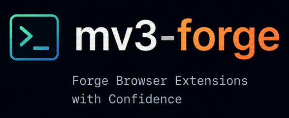

<p align="center">
  
</p>

# mv3-forge

[](https://www.npmjs.com/)
[](https://opensource.org/licenses/MIT)
[](https://nodejs.org)
[](https://pnpm.io)

A modern CLI tool for scaffolding cross-browser extensions with Manifest V3 support. Quickly bootstrap your browser extension project with pre-configured templates using TypeScript and Vite.

## Features

- 🚀 **Quick Setup** - Create browser extensions in seconds with pre-configured templates
- 📦 **Multiple Templates** - Support for vanilla, React, Vue, Solid, and Svelte
- 🎯 **Manifest V3** - Modern extension manifest with best practices baked in
- ⚡ **Vite-powered** - Fast development with hot module replacement
- 🔧 **TypeScript** - Full TypeScript support out of the box
- 🌐 **Cross-browser** - Compatible with Chrome, Firefox, and other Chromium-based browsers

## Installation

### Using npx (recommended)

```bash
npx mv3-forge new my-extension
```

### Using pnpm

```bash
pnpm dlx mv3-forge new my-extension
```

### Using npm

```bash
npm exec mv3-forge new my-extension
```

### Using yarn

```bash
yarn dlx mv3-forge new my-extension
```

### Using npm (install first)

```bash
npm i mv3-forge
mv3-forge new my-extension
```

## Quick Start

```bash
# Create a new extension project
npx mv3-forge new my-extension

# Or with pnpm
pnpm dlx mv3-forge new my-extension

# Navigate to your project
cd my-extension

# Install dependencies
pnpm install

# Start development server
pnpm dev
```

Then load the extension in your browser:

- **Chrome/Edge/Brave**: Go to `chrome://extensions`, enable "Developer mode", click "Load unpacked", and select the `dist/` folder
- **Firefox**: Go to `about:debugging`, click "This Firefox", then "Load Temporary Add-on" and select `dist/manifest.json`

## Usage

### Interactive Mode

Run the CLI without arguments for an interactive prompt:

```bash
mv3-forge new
# or
npx mv3-forge new
```

### CLI Options

```bash
mv3-forge new [project-name] [options]

Options:
  -t, --template <template>  Template to use (vanilla, react, vue, solid, svelte)
  -h, --help              Display help for command
  -V, --version           Display version number
```

### Examples

```bash
# Create with vanilla template
npx mv3-forge new my-extension --template vanilla

# Create with React template
npx mv3-forge new my-extension --template react

# Create with Vue template
npx mv3-forge new my-extension --template vue
```

## Available Templates

| Template | Description | Status |
|----------|-------------|--------|
| `vanilla` | Plain TypeScript with Vite | ✅ Available |
| `react` | React + TypeScript + Vite | ✅ Available |
| `vue` | Vue + TypeScript + Vite | 🚧 Coming Soon |
| `solid` | Solid + TypeScript + Vite | 🚧 Coming Soon |
| `svelte` | Svelte + TypeScript + Vite | 🚧 Coming Soon |

## Project Structure (vanilla template)

```
my-extension/
├── icons/               # Icon assets
├── src/
│   ├── background.ts    # Background service worker
│   ├── content.ts       # Content script
│   ├── popup.ts         # Popup script
│   ├── popup.html       # Popup UI
│   ├── index.html       # Options page
│   └── styles.css       # Styles
├── dist/                # Build output
├── .gitignore           # Gitignore
├── manifest.json        # Extension manifest
├── package.json
├── tsconfig.json
└── vite.config.ts
```

## Packages

This is a monorepo managed by Turborepo. The following packages are available:

| Package | Description |
|---------|-------------|
| `@mv3-forge/cli` | Command-line interface for scaffolding extensions |
| `@mv3-forge/core` | Core project generation logic |
| `@mv3-forge/shared` | Shared utilities and helpers |
| `@mv3-forge/testing` | Testing utilities |
| `@mv3-forge/vite-plugin` | Vite plugin for extension development |

## Development

### Prerequisites

- Node.js >= 18
- pnpm >= 8

### Setup

```bash
# Clone the repository
git clone https://github.com/ZaheerAhmedkhan65/mv3-forge.git
cd mv3-forge

# Install dependencies
pnpm install

# Build all packages
pnpm build

# Run linter
pnpm lint

# Run tests
pnpm test
```

### Package Scripts

Each package has its own scripts defined in its `package.json`:

```bash
# Build specific package
pnpm build --filter=@mv3-forge/cli

# Watch mode for development
pnpm dev --filter=@mv3-forge/core
```

## Contributing

Contributions are welcome! Please feel free to submit a Pull Request.

1. Fork the repository
2. Create your feature branch (`git checkout -b feature/amazing-feature`)
3. Commit your changes (`git commit -m 'Add amazing feature'`)
4. Push to the branch (`git push origin feature/amazing-feature`)
5. Open a Pull Request

## Roadmap

- [ ] Add React template with pre-configured setup
- [ ] Add Vue template support
- [ ] Add Solid template support
- [ ] Add Svelte template support
- [ ] Add comprehensive testing utilities
- [ ] Add Vite plugin for improved HMR and manifest handling
- [ ] Add Firefox-specific manifest generation
- [ ] Add Chrome Web Store publishing support

## License

MIT © [Zaheer Ahmed](https://github.com/ZaheerAhmedkhan65)

## Acknowledgments

- Built with [Vite](https://vitejs.dev/) - Next generation frontend tooling
- CLI prompts powered by [@clack/prompts](https://github.com/briarvine/clack)
- Monorepo managed by [Turborepo](https://turbo.build/repo)